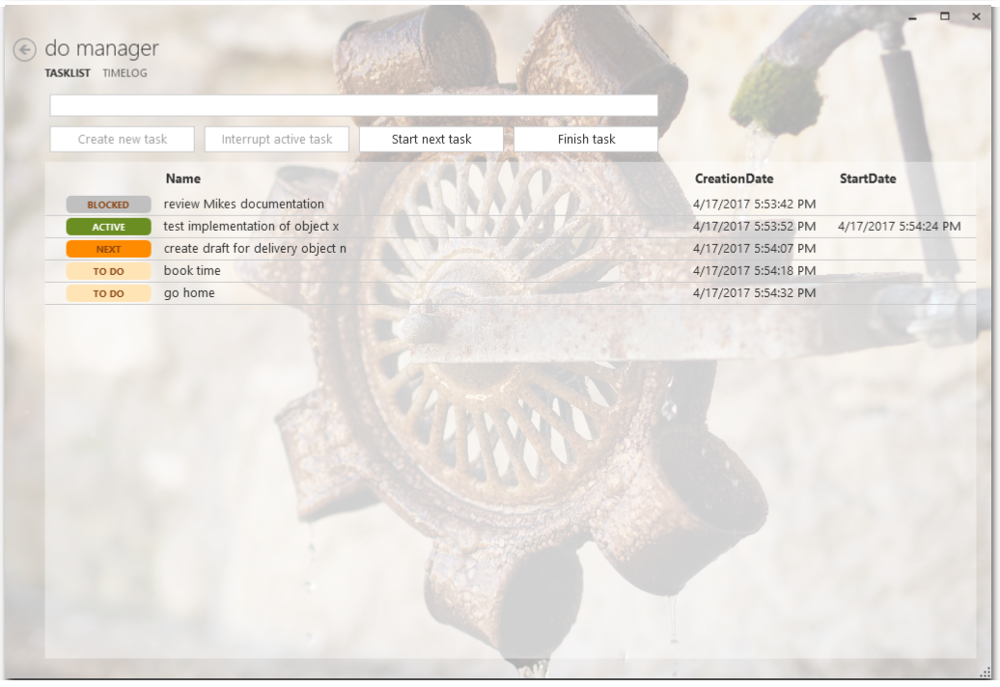

# DoManager

## Build Status

## Quickstart

Download the [ZIP file](https://ci.appveyor.com/project/viper3400/domanager/build/artifacts) and extract it. No installation or setup, it’s portable.

The ZIP file contains a template database (TEMPLATE.FDB). You could use this template right away or copy and rename this template to a more friendly name.

When starting DoManger it will ask you to select a database. Select your copied database template file to start.

When creating time logs reports are saved under your user's documents folder. A subfolder “DoManagerReports” will be created automatically if it not exists.

## Screenshot

