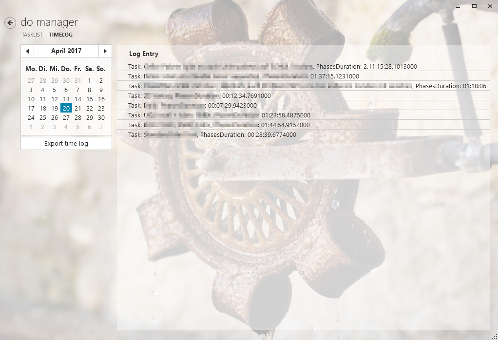

# DoManager

## Build Status

## Requirements

* NET Framework 4.5.2

## Quickstart

Download the [ZIP file](https://github.com/viper3400/DoManager/releases/latest) and extract it. No installation or setup, it’s portable.

The ZIP file contains a template database (TEMPLATE.FDB). You could use this template right away or copy and rename this template to a more friendly name. Make sure, your Windows user has the rights to write to the *.FDB file. Otherwise DoManger won't run correct and will crash on application shutdown (see https://github.com/viper3400/DoManager/issues/12).

When starting DoManger, it will ask you to select a database. Select your copied database template file to start.

When creating time logs reports are saved under your user's documents folder. A subfolder “DoManagerReports” will be created automatically if it not exists.

## Screenshots

### Task List (Main View)

### Time Log View

## Usage

### Change a Task Name

Once you've created a task you could still edit it's name. Double click on the name in the task list and provide the new name. ENTER will save your changes.

### Start Task

You will only be able to start the task which is marked as NEXT (by clicking on the corresponding button). NEXT task will become the new ACTIVE task and the new NEXT task will be determined.

### Change NEXT Task

NEXT task is always the first, not BLOCKED task in the list. Use the context menu (right mouse button) to mark the next task manually. You can only mark one task as next task (because you won't be able to do more than one thing next ...).

### Interrupt active task

You could interrupt the active task in three ways:

* Provide a new task name in the upper textbox (same as creating a new task) and click on button "Interrupt active task".
  * This will stop the active task immediately,
  * will create a new task, 
  * set the new task active and 
  * set the old task NEXT
* Mark an active task as BLOCKED (context menu)
* Mark an active task as NEXT

### BLOCK a Task

Use the context menu (right mouse button) to mark a task as BLOCKED. It won't be become NEXT until you unblock it or set it NEXT manually.

## Third Party 

* http://www.firebirdsql.org/
* https://autofac.org/
* http://nlog-project.org/
* http://www.dapplo.net/blocks/Dapplo.LogFacade/
* https://github.com/firstfloorsoftware/mui
* http://www.galasoft.ch/mvvm

